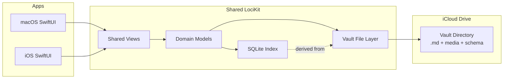
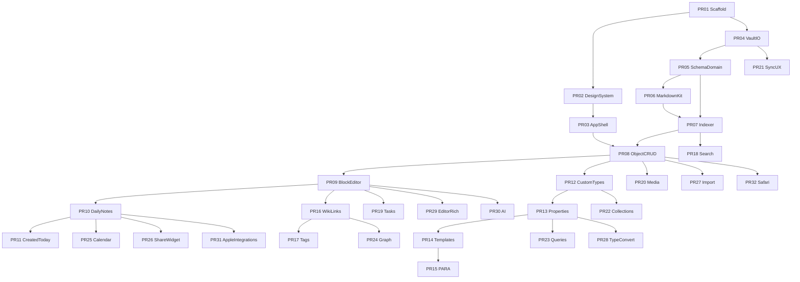
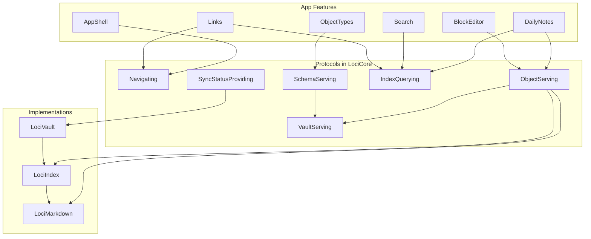

---
todos:
  - id: arch-research
    content: Research local-first / iCloud / SwiftUI modular best practices; write separate summary
    status: completed
  - id: arch-skill
    content: Create loci-feature-architecture agent skill
    status: completed
  - id: arch-plan
    content: 'Expand plan with codebase architecture, boundaries, file maps; fix holes'
    status: completed
  - id: pr01-scaffold
    status: in_progress
    content: 'PR01: Xcode multiplatform scaffold, targets, package layout, CI smoke'
  - id: pr02-design-system
    content: 'PR02: Design tokens + shared UI primitives'
    status: pending
  - id: pr03-app-shell
    content: 'PR03: App shell navigation (sidebar / split / tabs) with placeholders'
    status: pending
  - id: pr04-vault-io
    content: 'PR04: VaultIO + iCloud Documents + local fallback'
    status: pending
  - id: pr05-schema-domain
    content: 'PR05: Domain models + schema.json + Page type bootstrap'
    status: pending
  - id: pr06-markdown-kit
    content: 'PR06: MarkdownKit parse/serialize + unit tests'
    status: pending
  - id: pr07-indexer
    content: 'PR07: SQLite Indexer + file watch rebuild'
    status: pending
  - id: pr08-object-crud
    content: 'PR08: Object CRUD (create/open/save Page) end-to-end'
    status: pending
  - id: pr09-block-editor
    content: 'PR09: Block editor MVP + slash menu'
    status: pending
  - id: pr10-daily-notes
    content: 'PR10: Daily notes auto-create + day navigation'
    status: pending
  - id: pr11-created-today
    content: 'PR11: Created-today auto links on daily notes'
    status: pending
  - id: pr12-custom-types
    content: 'PR12: Custom object types on the fly + type dashboards'
    status: pending
  - id: pr13-properties
    content: 'PR13: Properties system + property editor panel'
    status: pending
  - id: pr14-templates
    content: 'PR14: Per-type templates + defaults'
    status: pending
  - id: pr15-para
    content: 'PR15: PARA starter pack (Project/Area/Resource/Archive)'
    status: pending
  - id: pr16-wikilinks
    content: 'PR16: Wiki-links, @ picker, backlinks panel'
    status: pending
  - id: pr17-tags
    content: 'PR17: Tags (#) cross-type + tag views'
    status: pending
  - id: pr18-search
    content: 'PR18: Global FTS search'
    status: pending
  - id: pr19-tasks
    content: 'PR19: Task blocks + today task list'
    status: completed
  - id: pr20-media
    content: 'PR20: Media attach + image objects in vault'
    status: pending
  - id: pr21-sync-ux
    content: 'PR21: iCloud sync status, conflicts, download-on-demand'
    status: pending
  - id: pr22-collections
    content: 'PR22: Collections within a type'
    status: pending
  - id: pr23-queries
    content: 'PR23: Saved queries + embeddable query blocks'
    status: completed
  - id: pr24-graph
    content: 'PR24: Graph view'
    status: completed
  - id: pr25-calendar
    content: 'PR25: Calendar UI around daily notes'
    status: pending
  - id: pr26-share-widget
    content: 'PR26: Share extension + iOS widget + macOS menu bar capture'
    status: pending
  - id: pr27-import
    content: 'PR27: Import Capacities/Obsidian/markdown folder'
    status: pending
  - id: pr28-type-convert
    content: 'PR28: Type conversion with property mapping'
    status: pending
  - id: pr29-editor-rich
    content: 'PR29: Richer editor (tables, toggles, code highlight)'
    status: pending
  - id: pr30-ai
    content: 'PR30: AI assist (BYOK / Apple Intelligence)'
    status: pending
  - id: pr31-apple-integrations
    content: 'PR31: Apple Calendar / Reminders integrations'
    status: pending
  - id: pr32-safari
    content: 'PR32: Safari web clipper extension'
    status: pending
name: Capacities iCloud Clone Spec
overview: 'Capacities.io research, Loci product/tech spec, stacked-PR build plan, and codebase architecture (domain-colocated Swift modules, vault-as-truth, local index) informed by a dedicated feature-architecture skill and best-practices research.'
isProject: false
---
# Capacities.io Feature Summary + Product Spec (iCloud-Local Clone)

Working name for the clone: **Loci**. Scope: personal PKM (no collaboration), Apple-only (macOS + iOS), local-first vault in iCloud Drive.

---

## Part 1 — Capacities.io feature set (research summary)

Capacities is an object-based personal knowledge management app (Capacities Labs GmbH, Germany). Core idea: notes are **typed objects** in a network, not files in folders. Platforms: web, desktop (macOS/Windows/Linux), iOS, Android. Free tier + Pro (AI, smart queries, calendar, tasks, reading integrations). Data hosted in EU; full export supported. Individual-focused (no team collab).

### Mental model

| Concept | Role |
|---|---|
| **Space** | Top-level workspace; links/search do not cross spaces |
| **Object** | Unit of content (title + properties + block body) |
| **Object type** | Schema for a class of objects (Book, Person, Page, …) |
| **Properties / labels** | Structured fields on a type (status, dates, object-select links) |
| **Tags** | Cross-type thematic keywords (`#health`); can tag objects or blocks |
| **Collections** | Manual curated groups *within* one type |
| **Queries** | Saved rule-based dynamic views (Pro for full power) |
| **Daily note** | One page per calendar day; inbox + chronological hub |
| **Backlinks / graph** | Bidirectional links + network visualization |
| **Templates** | Per-type content/property presets; optional default on create |

### Built-in object types

Page, Tag, Image, Weblink, Audio, PDF, Files, Tweet (limited), AI Chat, Query, Table — plus **custom types** created on the fly (Books, People, Recipes, Projects, Areas, Meetings, …).

### Capture and writing

- Daily note as primary inbox; date navigation and “created on this day” overview
- Block editor: headings, lists, toggles, quotes, math, code (100+ langs, Mermaid), tables, columns, embeds (images/PDF/audio/video)
- `/` commands and markdown shortcuts; `@` / `[[` linking; inline `#tag`
- Convert a line/selection into a typed object (inherits type properties + template)
- Quick capture: WhatsApp, Telegram, email, web clipper, Raycast (integrations vary by plan)

### Structure and retrieval

- Object dashboards per type (recent, untagged, no backlinks, collections, pinned queries)
- Filter / sort / group; list, table, gallery, wall views
- Type conversion with property mapping
- Related content / unlinked mentions (Pro)
- Full-text search across the space
- Calendar as time anchor (daily notes, date refs, created-that-day); Pro: Google/Outlook events as objects
- Tasks in notes + calendar (Pro); sync out to Todoist/Things/TickTick/Reminders/Google Tasks
- Reading: Readwise, Kindle, web highlights (Pro)

### PARA mapping (official guidance)

- **Projects / Areas** → dedicated object types (+ templates/properties)
- **Resources** → whole space, or `#resource` tag
- **Archive** → `#archive` tag or status filters (not a folder move)
- **Inbox** → daily note

### AI (Pro)

Chat over notes, rewrite/summarize/translate, property auto-fill, auto-tag/collection suggestions, image analysis (OCR, palette, category), MCP connectors to external AI tools, optional BYOK providers.

### Export / portability

Space export to markdown with YAML frontmatter, media folders, local links, collections as CSV; single-object export to MD/PDF/DOCX/LaTeX; views to CSV.

### Gaps (useful for a clone)

Mobile is secondary to desktop; no real-time collaboration; cloud-hosted (not user-owned file vault); Android/Windows/Linux matter for Capacities but not for this Apple-only clone.

---

## Part 2 — Product vision for Loci

**Loci** is a Capacities-style object PKM that keeps the entire knowledge base as a **readable vault of markdown (and media) inside an iCloud Drive directory**. Sync is Apple’s file sync, not a custom server. One SwiftUI app targets **macOS and iOS** with a shared codebase.

Differentiators vs Capacities:

- User-owned files in Finder / Files.app
- Offline-first; works without a Loci backend
- No account beyond Apple ID / iCloud
- Vault format compatible with other markdown tools where practical

---

## Part 3 — Technology choice (committed)

| Layer | Choice | Why |
|---|---|---|
| UI + platforms | **SwiftUI** multiplatform (iOS 17+, macOS 14+) | One Xcode project, high UI/logic reuse, first-class Apple APIs |
| Storage | **iCloud Documents** ubiquity container, published to iCloud Drive | Matches “data in an iCloud directory”; visible on Mac and iPhone |
| On-disk notes | Markdown + YAML frontmatter + relative media paths | Human-readable; Capacities-export-like; portable |
| Local index | **SQLite/GRDB in Application Support only** (never inside the vault) | Fast search/graph/queries; disposable projection |
| File I/O | `NSFileCoordinator` + `NSMetadataQuery` / document sessions | Safe concurrent access under iCloud |
| Editor | Custom block editor over an AST that serializes to markdown flavor | Capacities-like UX while staying file-based |
| Architecture skill | [`.cursor/skills/loci-feature-architecture/SKILL.md`](/agent/.cursor/skills/loci-feature-architecture/SKILL.md) | Governs every feature PR |
| Best practices (separate) | [`docs/architecture-best-practices.md`](/agent/docs/architecture-best-practices.md) | Research summary outside this plan |
| Optional later | CloudKit only for *app settings* / device prefs — **not** note bodies | Keeps knowledge in the directory |

**Rejected for v1:** Electron/Tauri, React Native, Flutter, Kotlin Multiplatform — weak or awkward iCloud Documents integration and poorer Mac+iPhone sharing for this storage model.

**Code sharing target:** ~90–95% shared (`LociKit` + shared SwiftUI scenes); thin platform shells for menu bar, keyboard shortcuts, widgets, share extension.



---

## Part 4 — On-disk vault format

Example layout (iCloud Drive → `Loci/` or app container `Documents/`):

```text
LociVault/                         # iCloud Drive or local Documents
  .loci/
    space.json                     # space settings, pins (small, rare writes)
    types/
      page.json                    # per-type schema (merge-friendly)
      book.json
      project.json
    templates/
      book.default.md
      daily.default.md
    trash/                         # soft-deleted files + tombstone manifests
  daily/
    2026-08-13.md                  # deterministic path; id derived from date
  objects/
    page/
    book/
    person/
    project/
    area/
    recipe/
  media/
    images/
    files/

# NOT in the vault — device-local only:
Application Support/Loci/<vaultId>/index.sqlite
```

**Why per-type schema files:** two devices editing different types must not conflict on one monolithic `schema.json`. **Why index is local:** syncing SQLite via iCloud corrupts DBs and fights the “files are truth” model.

**Document file shape:**

```markdown
---
id: 8f3c2a1e-...
type: book
title: Deep Work
created: 2026-08-13T09:12:00Z
updated: 2026-08-13T11:40:00Z
tags: [focus, career]
properties:
  status: Reading
  author: ["[[people/cal-newport]]"]
  rating: 5
template: default-book
---

## Notes

Key idea: attention is a skill.

Related: [[projects/q3-writing]]
```

**Markdown flavor (Loci MD):** CommonMark + GFM tables/task lists + wiki-links `[[id-or-slug]]` + `#tags` + callout/toggle conventions + embedded media ``. Block editor reads/writes this AST; raw markdown remains valid.

**Schema file** defines types (name, icon, color), property types (text, number, date, select/label, multi-select, object-select, checkbox, url), default template id, dashboard config, card preview fields.

**Conflict policy:** last-writer-wins at file level (iCloud); on divergent copies, keep both as `title (conflicted copy).md` and surface in UI. Index reconciles by `id` in frontmatter.

---

## Part 5 — Core product requirements

### 5.1 Daily notes

- Auto-create today’s daily note on first open (from default daily template)
- Auto-maintain a **“Created today”** inspector/panel listing all objects with `created` date = that day, as live links — **index-derived UI only; do not rewrite the daily `.md` on each create** (avoids cross-device thrash)
- Also surface: tasks due/completed that day, date mentions, calendar items (phase 2)
- Navigate by calendar / prev-next day; week review friendly
- Daily note is the default inbox / launch surface on mobile

### 5.2 Documents as markdown

- Every object is a file (or media object + sidecar metadata)
- User can browse/edit vault in Finder/Files and other editors; app reindexes on change
- Import: folder of markdown, Capacities-style export, Obsidian vault (best-effort)
- Export: already *is* the vault; plus PDF/single-note share

### 5.3 PARA + custom types on the fly

- Starter pack: **Project**, **Area**, **Resource** (or Page + `#resource`), **Archive** via status/tag — matching Capacities PARA guidance
- Create custom types anytime (Books, People, Recipes, …) with icon/color
- Sidebar lists each type; type dashboard with All / filters / collections
- Type conversion with property mapping
- Objects never “live in a folder” logically; filesystem folders are storage sharding only

### 5.4 Templates

- Per-type templates: prefilled body blocks + default property values
- Star one template as **default** for new objects and for new daily notes
- Apply template on create; optionally re-apply to empty objects
- Template files stored under `.loci/templates/` or embedded in `schema.json`

### 5.5 Linking, backlinks, graph

- Bidirectional links via `[[...]]` / `@` picker
- Backlinks panel on every object
- Unlinked mentions (scan titles) — phase 2
- Graph view: force-directed, filter by type, hide high-degree nodes — phase 2 polish, basic graph in MVP

### 5.6 Properties, tags, collections, queries

- Property types as above; object-select creates real links
- Tags cross-type; aliases supported
- Collections: manual membership lists per type (stored in schema or `collections/*.json`)
- Queries: saved filters (type + property/tag rules); embeddable query blocks in notes — MVP simple; advanced (formulas, relative dates) later

### 5.7 Editor (Capacities-parity targets)

MVP: headings, paragraphs, bullets/numbered, tasks, quotes, code, images, wiki-links, tags, simple tables, `/` menu, markdown paste.

Later: toggles/columns, math, Mermaid, PDF/audio embeds, block-to-object conversion, multi-column layouts.

### 5.8 Other Capacities-inspired features (phased)

| Feature | Phase |
|---|---|
| Global search (FTS5) | MVP |
| Object dashboards + filter/sort/group | MVP |
| Media objects (image/file) in vault | MVP |
| Weblink objects + link preview metadata cache | MVP light |
| Tasks in notes + “today” task list | MVP |
| Graph view | MVP basic / v1.1 polish |
| Calendar UI around daily notes | v1.1 |
| Apple Calendar event → Meeting object | v1.2 |
| Share extension + iOS widget (open daily / quick capture) | v1.1 |
| AI assist (Apple Intelligence / user API key): summarize, rewrite, property fill | v1.2 |
| Readwise/Kindle import | Later |
| Web clipper (Safari extension) | Later |
| Smart queries / kanban by label | v1.1 |
| Multiple spaces (multiple vault folders) | v1.1 |

---

## Part 6 — App UX (desktop + mobile)

**Shared navigation**

- Left: Daily, Search, pinned items, object types, tags, settings
- Center: editor
- Right (desktop / sheet on mobile): properties, backlinks, outline, “created that day” for dailies

**macOS**

- Multi-window / multiple tabs; full keyboard shortcuts; menu bar quick capture; Finder integration (open vault folder)

**iOS**

- Daily-first home; quick capture sheet; Files-backed vault download-on-demand awareness; Share extension → append to today or create typed object
- Widget: open today / new inbox line

**Sync UX**

- Explicit sync status (iCloud account, waiting to upload/download, conflict)
- On iPhone, ensure critical files are downloaded when opening; background metadata query keeps index fresh

---

## Part 7 — Domain model (in-app)

```text
Space
  └─ ObjectType (id, name, icon, properties[], templates[], dashboard)
Object
  └─ id, typeId, title, properties, blocks/markdown, tags[], created, updated, path
Link (fromId, toId, kind: wikilink | property | tag)
Tag, Collection, Query, Template
DailyNote extends Object (date key)
```

Index tables: `objects`, `blocks_fts`, `links`, `tags`, `properties_idx`, `daily_created` — all derived; files are source of truth.

---

## Part 8 — Architecture modules (mapped to packages)

1. **LociVault** (`VaultServing`) — ubiquity/local roots, coordinated I/O, metadata query, document sessions, trash/tombstones  
2. **SchemaStore** (`SchemaServing`) — per-type schema files + templates + space.json  
3. **LociIndex** (`IndexQuerying` / `IndexUpdating`) — local SQLite projection; FTS; links/tags/created-on  
4. **LociMarkdown** — parse/serialize Loci MD ↔ block AST + frontmatter  
5. **ObjectService** (`ObjectServing`) — high-level CRUD/rename/convert; single orchestration entry for features  
6. **LinkResolver** — lives with Index (id/slug/title); backlinks queries  
7. **QueryEngine** — filter DSL over Index (Wave C)  
8. **Features** — AppShell, BlockEditor, DailyNotes, … (domain folders; see Part 13)  
9. **Composition root** — `AppServices` wires protocols; no feature imports another feature  

Details, file maps, and boundary contracts: **Part 13**. Research: `docs/architecture-best-practices.md`. Skill: `.cursor/skills/loci-feature-architecture`.

---

## Part 9 — Delivery phases (summary)

- **Foundation (PR01–PR08):** scaffold, design system, shell, vault I/O, schema, markdown, index, object CRUD  
- **MVP core (PR09–PR21):** editor, daily notes, created-today, types, properties, templates, PARA, links, tags, search, tasks, media, sync UX  
- **Depth (PR22–PR29):** collections, queries, graph, calendar, capture surfaces, import, type convert, richer editor  
- **Intelligence (PR30–PR32):** AI, Calendar/Reminders, Safari clipper  

Stacked PRs land in order; each PR is mergeable and demoable on top of the previous stack. Details in Part 12.

---

## Part 10 — Non-functional requirements

- Local-first: all reads/writes work offline; sync when iCloud available  
- No Loci server; no vendor lock-in beyond Apple ID for sync  
- Performance: 10k+ objects — search &lt; 100ms on index; editor stays smooth via incremental parse  
- Privacy: vault content never leaves iCloud account except user-initiated export/AI BYOK  
- Accessibility: Dynamic Type, VoiceOver on primary flows  
- Testing: VaultIO + MarkdownKit + Indexer unit tests; sync integration tests on two simulators/devices where possible  

---

## Part 11 — Explicit non-goals (v1)

- Windows / Android / web client  
- Real-time multi-user collaboration  
- Hosting a proprietary cloud API for notes  
- Pixel-perfect clone of Capacities UI/branding  
- Plugin marketplace  

---

## Success criteria

1. User creates a Book type + template on Mac; new book on iPhone uses that template after iCloud sync.  
2. Creating any object today auto-links it from today’s daily note “Created today” list.  
3. Vault folder in Finder shows readable `.md` files that round-trip after external edits.  
4. PARA starter types + arbitrary custom types work without folders-as-hierarchy in the UX.  
5. One shared codebase ships Mac app + iPhone app from the same project.

---

## Part 12 — Full modular build plan (stacked PRs)

### Principles

- **One feature (or one infrastructure slice) per PR** — reviewable, mergeable, demoable.
- **Stack upward** — each PR branches from the previous PR’s head until that base merges to `main`.
- **Vertical slices after foundation** — once VaultIO + Indexer exist, each feature ships UI + domain + persistence together.
- **Tests travel with the PR** that introduces the logic (MarkdownKit, Indexer, QueryEngine especially).
- **No big-bang editor** — editor grows in PR09 (MVP) then PR29 (richer blocks).
- **iCloud is real from PR04**, but every feature must also work with a **local Documents fallback** for CI/simulators without iCloud entitlements.

### Branch / PR naming

```text
cursor/pr01-scaffold-d2c1
cursor/pr02-design-system-d2c1
…
cursor/pr32-safari-clipper-d2c1
```

PR title format: `PRNN: <short feature name>`.

### Dependency graph



Strict linear merge order for the stack (simplest ops): **PR01 → PR32 in numeric order**. Parallel work is possible only after merge of shared bases (e.g. PR22 and PR24 after their deps land on `main`).

---

### Wave A — Foundation

#### PR01 — App scaffolding
**Builds:** Xcode project / workspace, `Loci` iOS + macOS targets, `LociKit` Swift package (or local SPM), folder conventions (`App/`, `LociKit/Sources/...`), README, `.gitignore`, basic CI (`xcodebuild` smoke for both destinations), empty `LociApp` entry points.  
**Demo:** App launches on iOS Simulator and Mac with a “Loci” placeholder screen.  
**Out of scope:** Real navigation, iCloud, design system.

#### PR02 — Design tokens and shared components
**Builds:** Color/typography/spacing tokens (CSS-variable-equivalent Swift enums or asset catalogs), light visual direction (avoid purple-default AI look; brand-forward shell), primitives: `LociButton`, `LociTextField`, `LociListRow`, `LociEmptyState`, `LociIcon`, `LociDivider`, sidebar row styles, focus/selection states. Motion baselines (2–3 subtle transitions for navigation/appearance).  
**Demo:** Design gallery screen listing components.  
**Depends on:** PR01.

#### PR03 — App shell navigation
**Builds:** Shared navigation model: macOS `NavigationSplitView` (sidebar | detail | optional inspector), iOS tab/stack adapted to daily-first later; destinations as placeholders: Daily, Search, Types, Settings; pin section stub; window/title wiring on Mac.  
**Demo:** Navigate placeholder destinations on both platforms with real chrome.  
**Depends on:** PR02.

#### PR04 — VaultIO + iCloud Documents
**Builds:** Ubiquity container entitlements, `NSUbiquitousContainers` Info.plist, resolve vault URL, create vault skeleton folders, coordinated read/write of arbitrary files, local sandbox fallback when iCloud unavailable, `NSMetadataQuery` wrapper emitting file change events, conflicted-copy detection hook.  
**Demo:** Settings “Create vault” writes `.loci/space.json`; file appears in iCloud Drive / local Documents; second device or resync sees it when iCloud enabled.  
**Depends on:** PR01 (can stack beside PR02/03; merge after PR01).

#### PR05 — Domain models + schema store
**Builds:** `Space`, `ObjectType`, `PropertyDef`, `LociObject` (metadata) in LociCore; per-type `.loci/types/page.json` + `space.json`; SchemaStore load/save via VaultServing; bootstrap built-in **Page**; daily flagged via type or dedicated daily type.  
**Demo:** On vault create, `page.json` exists; Settings shows type list (read-only).  
**Depends on:** PR04.

#### PR06 — MarkdownKit
**Builds:** Loci MD ↔ block AST: paragraphs, headings, lists, task items, quotes, code fences, wiki-links, `#tags`, images; YAML frontmatter encode/decode; round-trip unit tests; fuzz fixtures.  
**Demo:** Unit tests green; tiny debug view “paste markdown → AST → markdown”.  
**Depends on:** PR05 (frontmatter fields align with domain).

#### PR07 — Indexer (SQLite)
**Builds:** GRDB/SQLite in **Application Support** (not vault); schema (`objects`, `links`, `tags`, `blocks_fts`, `properties_idx`); full scan + incremental Vault events; rebuild command; `IndexQuerying` APIs: `object(id:)`, `objects(type:)`, `search`, `created(on:)`.  
**Demo:** Writing a `.md` via Vault makes it queryable in a debug Index browser; confirm no `index.sqlite` inside the vault folder.  
**Depends on:** PR05, PR06.

#### PR08 — Object CRUD end-to-end
**Builds:** `ObjectService`; Create Page → write under `objects/page/` → open → edit title → debounced save; list Pages; delete → trash+tombstone; AppShell “New Page”; onboarding → shell.  
**Demo:** Full loop on Mac and iPhone with local or iCloud vault.  
**Depends on:** PR03, PR07.  
**Milestone:** First vertical slice — “notes that persist in the vault.”

---

### Wave B — MVP core features (one PR each)

#### PR09 — Block editor MVP
**Builds:** EditorUI bound to block AST; typing, enter/split, basic formatting, `/` slash menu (heading/list/task/quote/code), markdown paste, autosave debounce to VaultIO; macOS keyboard shortcuts.  
**Demo:** Write a structured note; reopen; disk markdown matches.  
**Depends on:** PR08.

#### PR10 — Daily notes
**Builds:** Auto-create today’s note from empty/default body; `daily/YYYY-MM-DD.md`; prev/next day + date picker; app launch opens today (esp. iOS); Daily sidebar item live.  
**Demo:** Open app two calendar days apart (simulated) → two daily files; navigate between them.  
**Depends on:** PR09.

#### PR11 — Created-today auto links
**Builds:** Indexer `created(on:)` feed; Daily note **inspector panel** (not body rewrite) **Created today** with live links; updates via index publishers when objects appear. Explicit user action may insert a snapshot list into the note later; default is UI-only.  
**Demo:** Create a Page → it appears under today’s Created today; tap opens it; daily file bytes unchanged by that create.  
**Depends on:** PR10.

#### PR12 — Custom object types + dashboards
**Builds:** Create type on the fly (name, icon, color); folder `types/<slug>/`; sidebar entry; type dashboard (All + recently opened); create object of that type; rename/delete type (with guards).  
**Demo:** Create Books → add “Deep Work” → appears only under Books.  
**Depends on:** PR08 (stacks after PR11 in linear order).

#### PR13 — Properties system
**Builds:** Property defs on types (text, number, date, select, multi-select, checkbox, url, object-select stub); property editor in inspector; values in YAML frontmatter; index property columns for filter/sort.  
**Demo:** Book type gets `status` + `rating`; edit on object; survives reload.  
**Depends on:** PR12.

#### PR14 — Templates
**Builds:** Template CRUD per type (body markdown + default property values); star default; apply on create for objects and daily notes; store under `.loci/templates/` or schema.  
**Demo:** Default Book template prefills headings; new daily uses daily template.  
**Depends on:** PR13, PR10.

#### PR15 — PARA starter pack
**Builds:** Onboarding or “Apply PARA pack”: Project, Area types with starter properties/templates; Resource guidance via tag or type; Archive via `#archive` or status + default sidebar filters hiding archived; short in-app explainer.  
**Demo:** Fresh vault → Apply PARA → Project/Area ready with templates.  
**Depends on:** PR14.

#### PR16 — Wiki-links and backlinks
**Builds:** `[[link]]` / `@` picker (search titles/types); LinkResolver; write links into markdown; backlinks panel in inspector; tap navigates; broken-link styling.  
**Demo:** Link Page A → B; open B → see backlink to A.  
**Depends on:** PR09, PR07.

#### PR17 — Tags
**Builds:** `#tag` in editor + object-level tags in frontmatter; tag index; tag browse view; aliases in schema; filter by tag on dashboards.  
**Demo:** Tag two different types with `#health`; tag page lists both.  
**Depends on:** PR16.

#### PR18 — Global search
**Builds:** Search destination using FTS5; results grouped by type; keyboard open (⌘K / iOS search); recent searches optional.  
**Demo:** Query finds title and body hits instantly on 1k fixture objects.  
**Depends on:** PR07 (UI after shell).

#### PR19 — Tasks
**Builds:** Task list blocks already in editor; task completion toggles persist; Today / Open tasks view aggregated from index; show open tasks on daily note side panel.  
**Demo:** Check task in a Page → appears completed in Today tasks.  
**Depends on:** PR09, PR07.

#### PR20 — Media
**Builds:** Attach image/file → copy into `media/`; markdown image syntax; Image basic object type; drag-drop on Mac; photos picker on iOS.  
**Demo:** Image in note syncs via vault folder; visible in Files.  
**Depends on:** PR08, PR09.

#### PR21 — Sync UX and resilience
**Builds:** Sync status chip (iCloud available / syncing / offline / error); ensure downloaded for open file; conflict list UI; “Rebuild index”; vault path reveal in Finder/Files.  
**Demo:** Airplane mode edit → reconnect → status clears; conflict copy surfaced.  
**Depends on:** PR04, PR08.  
**Milestone:** **MVP complete** — Capacities-core daily loop + types + templates + links usable on Mac and iPhone via iCloud directory.

---

### Wave C — Depth (Capacities-parity expansions)

#### PR22 — Collections
**Builds:** Manual collections per type; membership file/json; collection tabs on type dashboard; add/remove objects.  
**Depends on:** PR12.

#### PR23 — Saved queries + embeds
**Builds:** QueryEngine DSL (type, tags, property ops, created/updated ranges); save query objects; pin to dashboard; `/query` embed block that renders live results in editor.  
**Depends on:** PR13, PR17.

#### PR24 — Graph view
**Builds:** Force-directed (or simple adjacency) graph from links table; filter by type; open object on node tap; basic performance cap.  
**Depends on:** PR16.

#### PR25 — Calendar UI
**Builds:** Month/week calendar anchored to daily notes; dots for days with content/creations; jump to daily.  
**Depends on:** PR10, PR11.

#### PR26 — Capture surfaces
**Builds:** iOS Share extension (append to today or create typed object); home-screen widget (Open today / Quick add); macOS menu bar quick capture.  
**Depends on:** PR10, PR08.

#### PR27 — Import
**Builds:** Importers: generic markdown folder, Obsidian vault (wiki-links best-effort), Capacities export (frontmatter/media mapping); dry-run summary.  
**Depends on:** PR08, PR06, PR12.

#### PR28 — Type conversion
**Builds:** Change object type with property mapping UI; move file between `types/` folders; update index/links.  
**Depends on:** PR13.

#### PR29 — Richer editor
**Builds:** Simple tables, toggles/callouts, code syntax highlighting, Mermaid render (optional WebKit), block-to-object conversion (“turn selection into Book”).  
**Depends on:** PR09, PR12.  
**Milestone:** **v1.1 feature-complete** vs Part 5.8 depth set.

---

### Wave D — Intelligence and integrations

#### PR30 — AI assist
**Builds:** Side panel actions: summarize, rewrite, translate; property auto-fill from title/body; BYOK provider settings; prefer on-device/Apple Intelligence when available; never upload vault unless user opts in.  
**Depends on:** PR09, PR13.

#### PR31 — Apple Calendar and Reminders
**Builds:** Event list on daily note; create Meeting-type object from event; optional Reminders sync for tasks.  
**Depends on:** PR10, PR19, PR12.

#### PR32 — Safari web clipper
**Builds:** Safari App Extension: send selection/page to daily note or Weblink object.  
**Depends on:** PR08, PR20.  
**Milestone:** **v1.2** integrations complete.

---

### What we build vs defer

| Build in this plan | Defer (not scheduled) |
|---|---|
| macOS + iOS SwiftUI app, shared LociKit | Windows / Android / web |
| iCloud Documents vault + local fallback | Custom Loci sync server |
| Object types, properties, templates, PARA | Team collaboration / sharing |
| Daily notes + created-today | WhatsApp/Telegram/email capture |
| Editor MVP → richer blocks | Full Capacities pixel UI clone |
| Links, tags, search, tasks, media | Readwise/Kindle (unless requested later) |
| Collections, queries, graph, calendar | Plugin marketplace |
| Share/widget/menu bar, import, AI, Apple Calendar/Reminders, Safari clipper | MCP connectors, Todoist/Things out-sync |

---

### Suggested merge cadence

- Land **Wave A (PR01–PR08)** as a tight stack — unblocks all product work.  
- Land **Wave B (PR09–PR21)** as the MVP release train; ship TestFlight after PR21.  
- Land **Wave C / D** as independent follow-up stacks from `main` once MVP is out (still one feature per PR).

### Per-PR acceptance checklist

1. Builds for iOS Simulator + macOS.  
2. Feature works against **local vault** in CI.  
3. If touching files: round-trip on disk (read fixtures in PR).  
4. No unrelated refactors.  
5. README or short PR description includes **demo steps**.  

### First execution step

Start with **PR01 (scaffold)** on branch `cursor/pr01-scaffold-d2c1`, then immediately stack **PR02** for design tokens so shell work is not unstyled. Every subsequent PR **must** follow [`.cursor/skills/loci-feature-architecture/SKILL.md`](/agent/.cursor/skills/loci-feature-architecture/SKILL.md).

---

## Part 13 — Codebase architecture (files, boundaries, connections)

Companion docs (not duplicated in full here):

- Best practices research: [`docs/architecture-best-practices.md`](/agent/docs/architecture-best-practices.md)
- Agent skill: [`.cursor/skills/loci-feature-architecture/SKILL.md`](/agent/.cursor/skills/loci-feature-architecture/SKILL.md)

### 13.1 Target / package layout

```text
Loci/
  Package.swift                    # or Xcode + local SPM packages
  LociCore/
    Sources/LociCore/
      IDs/ObjectID.swift
      Errors/LociError.swift
      Models/LociObjectMeta.swift
      Models/ObjectTypeID.swift
      Models/PropertyValue.swift
      Models/SpaceSettings.swift
      Protocols/VaultServing.swift
      Protocols/SchemaServing.swift
      Protocols/ObjectServing.swift
      Protocols/IndexQuerying.swift
      Protocols/IndexUpdating.swift
      Protocols/Navigating.swift
      Protocols/SyncStatusProviding.swift
      Navigation/Route.swift
  LociMarkdown/
    Sources/LociMarkdown/
      BlockAST.swift
      FrontMatter.swift
      MarkdownParser.swift
      MarkdownSerializer.swift
      WikiLinkSyntax.swift
    Tests/...
  LociVault/
    Sources/LociVault/
      VaultRoot.swift              # iCloud vs local resolution
      FileCoordinatorClient.swift
      MetadataQueryMonitor.swift
      DocumentSession.swift        # open-file presenter / dirty state bridge
      VaultService.swift
      TombstoneStore.swift
    Tests/...
  LociIndex/
    Sources/LociIndex/
      Database/IndexDatabase.swift # Application Support path
      Database/Schema.swift
      IndexService.swift
      IndexWriters/ObjectIndexer.swift
      IndexWriters/LinkIndexer.swift
      Queries/SearchQuery.swift
      Queries/CreatedOnQuery.swift
    Tests/...
  LociDesignSystem/
    Sources/LociDesignSystem/
      Tokens/Colors.swift
      Tokens/Typography.swift
      Tokens/Spacing.swift
      Components/LociButton.swift
      Components/LociListRow.swift
      Components/LociEmptyState.swift
      Motion/Transitions.swift
  App/
    LociApp.swift                  # composition root
    Composition/AppServices.swift  # wires concretes → Environment
    Features/                      # domain co-located features (below)
    Platform/iOS/...
    Platform/macOS/...
```

**Modularity rule:** packages are infrastructure walls (`Core`, `Vault`, `Markdown`, `Index`, `DesignSystem`). **Features are folders**, not SPM packages, until a real isolation need appears.

### 13.2 Feature folders (domain co-location)

```text
App/Features/
  AppShell/
  Onboarding/
  VaultSetup/
  ObjectEditor/          # generic open object + editor host
  BlockEditor/           # editor chrome, slash menu, keymap
  DailyNotes/
  CreatedToday/          # panel bound to IndexQuerying (can live under DailyNotes/)
  ObjectTypes/
  Properties/
  Templates/
  PARA/
  Links/                 # picker + backlinks panel
  Tags/
  Search/
  Tasks/
  Media/
  SyncStatus/
  Collections/
  Queries/
  Graph/
  Calendar/
  Capture/               # share, widget, menu bar
  ImportExport/
  TypeConversion/
  AI/
  AppleIntegrations/
  SafariClipper/
```

Each feature folder owns its UI + feature-local helpers. Shared models/protocols stay in `LociCore`.

### 13.3 Runtime connection map



**Write path:** Feature → `ObjectServing` → Markdown serialize → `VaultServing` → event → `IndexUpdating` (async).  
**Read path (lists/search/panels):** Feature → `IndexQuerying`.  
**Read path (open body):** Feature → `ObjectServing.open` → Vault read → Markdown parse → `EditorSession`.

### 13.4 Feature boundaries and contracts

| Feature | Provides | Requires | Writes vault? |
|---|---|---|---|
| AppShell | sidebar, split layout, route host | Navigating, SchemaServing (type list), SyncStatus | no |
| VaultSetup/Onboarding | create/open vault | VaultServing, SchemaServing | yes (skeleton) |
| ObjectEditor | hosts title + BlockEditor + inspector slots | ObjectServing, Navigating | via ObjectServing |
| BlockEditor | edits BlockAST, slash menu | ObjectServing.save, IndexQuerying (pickers) | via save |
| DailyNotes | today lifecycle, day nav | ObjectServing, SchemaServing (daily template) | yes (`daily/…`) |
| CreatedToday | panel | IndexQuerying.created(on:) | **no** |
| ObjectTypes | CRUD types, dashboards | SchemaServing, IndexQuerying, ObjectServing | yes (type json + objects) |
| Properties | defs + inspector fields | SchemaServing, ObjectServing | yes (frontmatter) |
| Templates | template CRUD/default | SchemaServing, ObjectServing | yes (`.loci/templates`) |
| PARA | pack apply | SchemaServing, Templates | yes (type defs) |
| Links | wiki picker, backlinks UI | IndexQuerying, Navigating, ObjectServing | yes (when user inserts link) |
| Tags | tag parse UX + browse | IndexQuerying, ObjectServing | yes (tags in FM/body) |
| Search | ⌘K / search UI | IndexQuerying, Navigating | no |
| Tasks | task aggregations | IndexQuerying, ObjectServing | yes (task markers) |
| Media | attach/display | VaultServing, ObjectServing | yes (`media/`) |
| SyncStatus | chips + conflict list | SyncStatusProviding, VaultServing | no (except resolve) |
| Collections/Queries/Graph/… | as in Wave C | Index + Schema (+ Object for embeds) | queries/collections metadata yes |

**Connection requirements between features:** none directly. Shared behavior goes through:

- `Navigating.open(objectID:)` 
- Index publishers (`objectsDidChange`)
- Inspector slot API on ObjectEditor (`InspectorModule` protocol registered at composition time)

### 13.5 Editor session (critical boundary)

```text
EditorSession/
  objectID, path, BlockAST, isDirty, revisionToken
  applyLocalEdit(_:)
  markSaved(revision:)
  proposeRemoteReload(newBytes:)  // never auto-clobber if dirty
```

Only one session writer per open object. Autosave debounced (e.g. 500ms idle + 5s max). Index updates after successful save, not on each keystroke.

### 13.6 Per-wave file creation plan

#### Wave A files (PR01–PR08)

| PR | New files (representative) |
|---|---|
| PR01 | `LociApp.swift`, `Package.swift` / xcodeproj, `AppServices.swift` stub, README, CI workflow |
| PR02 | `LociDesignSystem/Tokens/*`, `Components/*`, `Features/AppShell/DesignGalleryView.swift` |
| PR03 | `Features/AppShell/{SidebarView,DetailHostView,InspectorHostView,AppRoute}.swift` |
| PR04 | `LociVault/{VaultRoot,VaultService,FileCoordinatorClient,MetadataQueryMonitor}.swift` + entitlements |
| PR05 | `LociCore/Models/*`, `Protocols/SchemaServing.swift`, `LociVault` or app `SchemaStore.swift`, seed `page.json` |
| PR06 | `LociMarkdown/{BlockAST,FrontMatter,Parser,Serializer}.swift` + tests/fixtures |
| PR07 | `LociIndex/{IndexDatabase,Schema,IndexService,ObjectIndexer}.swift` + tests |
| PR08 | `Features/ObjectEditor/*`, `ObjectService.swift` (implements ObjectServing), `Features/Onboarding/*` |

#### Wave B files (PR09–PR21) — one domain folder per PR

| PR | Domain folder + key types |
|---|---|
| PR09 | `Features/BlockEditor/{BlockEditorView,SlashMenu,EditorSession,Keymap}.swift` |
| PR10 | `Features/DailyNotes/{DailyNoteService,DailyNoteView,DaySwitcher}.swift` — deterministic id `daily-{yyyy-mm-dd}` |
| PR11 | `Features/DailyNotes/CreatedTodayPanel.swift` (index-only) |
| PR12 | `Features/ObjectTypes/{TypeEditor,TypeDashboard,TypeList}.swift` |
| PR13 | `Features/Properties/{PropertyEditor,PropertyDraft}.swift` + Core property types |
| PR14 | `Features/Templates/{TemplateStore,TemplatePicker}.swift` |
| PR15 | `Features/PARA/PARAPack.swift` + starter json/templates |
| PR16 | `Features/Links/{LinkPicker,BacklinksPanel,LinkResolver}.swift` (resolver may sit in Index) |
| PR17 | `Features/Tags/{TagBrowseView,TagCompleter}.swift` |
| PR18 | `Features/Search/SearchView.swift` |
| PR19 | `Features/Tasks/{TaskListView,TaskIndexer}.swift` |
| PR20 | `Features/Media/{MediaInserter,ImageObjectFactory}.swift` |
| PR21 | `Features/SyncStatus/{SyncChip,ConflictList}.swift` |

Waves C–D follow the same pattern: new domain folder + protocol extensions only when needed; no cross-feature imports.

### 13.7 Keeping files small

- Cap ~250 lines; extract `*Formatting.swift`, `*Rules.swift`, `*ViewState.swift` when growing.
- Parser vs serializer vs AST in separate files (already).
- No “Manager.swift” god objects — `ObjectService` orchestrates; Vault/Index/Markdown stay ignorant of SwiftUI.
- View files contain SwiftUI + light view state (`@Observable` feature models), not SQL.

### 13.8 Testing seams

- `LociMarkdown` fixtures: round-trip `.md` files.
- `LociVault` with temp local root (no iCloud in unit tests).
- `LociIndex` against temp DB + vault fixtures.
- Feature tests with protocol fakes (`MockObjectService`).
- One smoke UI test: create page → appears in index → open daily created-today panel.

---

## Part 14 — Holistic evaluation: holes and fixes

Review of the earlier plan against best practices. **Weak points and how the architecture above fixes them:**

| Hole / what won’t work | Why | Fix (now in plan) |
|---|---|---|
| SQLite inside iCloud vault | DB corruption, constant conflicts, not human-readable truth | Index only in Application Support; rebuild from files |
| Monolithic `schema.json` | Concurrent type edits → full-file LWW loss | Per-type `.loci/types/<type>.json` + small `space.json` |
| Writing “Created today” into daily markdown | Every new object dirty-writes daily note → sync thrash / conflicts | UI panel from `IndexQuerying` only |
| Non-deterministic daily note ids/paths | Two devices create two “todays” | Fixed path `daily/YYYY-MM-DD.md` + derived id |
| Editor + background indexer both rewriting files | Cursor loss, content ping-pong | `EditorSession` single writer; index never writes note bodies |
| Treating iCloud like a local folder on iOS | Metadata without bytes → parse failures | Download-on-demand checks in Vault before read |
| Persisted file URLs | Break when iCloud moves items | Identity = `ObjectID`; locate via metadata query / relative vault path |
| Over-splitting SPM per feature | Slow builds, dependency hell | 5 infra packages + feature folders in app |
| Assuming CRDT-quality merge | Plain file sync is LWW | Narrow writes, deterministic paths, conflict UX; CRDT deferred |
| Index on main/typing path | Jank | Async `IndexUpdating`; stale-while-revalidate panels |
| Cross-feature coupling as features grow | Unmaintainable ball of mud | Protocol + composition root; Inspector modules registered centrally |
| Search/graph without link table updates on rename | Broken backlinks | `ObjectServing.rename` updates path + triggers link reindex by id |
| Soft delete without tombstones | Resurrect from other device cache | `.loci/trash` + tombstone manifest consumed by indexer |
| CI can’t run without Apple iCloud entitlements | Red builds | Local vault root mandatory; all tests use it |
| Share extension / widget process | No access to in-memory index | Extensions write inbox files into vault; main app indexes on foreground |
| AI uploading vault silently | Privacy failure | Explicit opt-in + BYOK; default on-device only |

### Residual risks (accepted)

- **Same-file concurrent edits** across devices can still produce iCloud conflicted copies — mitigated by UX, not eliminated without CRDTs.
- **Custom block editor cost** is high — MVP ships smaller block set; PR29 expands.
- **Large vaults (10k+)** need incremental index and virtualized lists — design allows it; perf work follows instrumentation after MVP.

### Architecture acceptance bar

The plan is ready to execute when PR01–PR08 produce: local vault skeleton, Page CRUD, markdown round-trip, local index queries, and dual-platform shell — with **no** index file inside the vault and **no** feature-to-feature imports.
